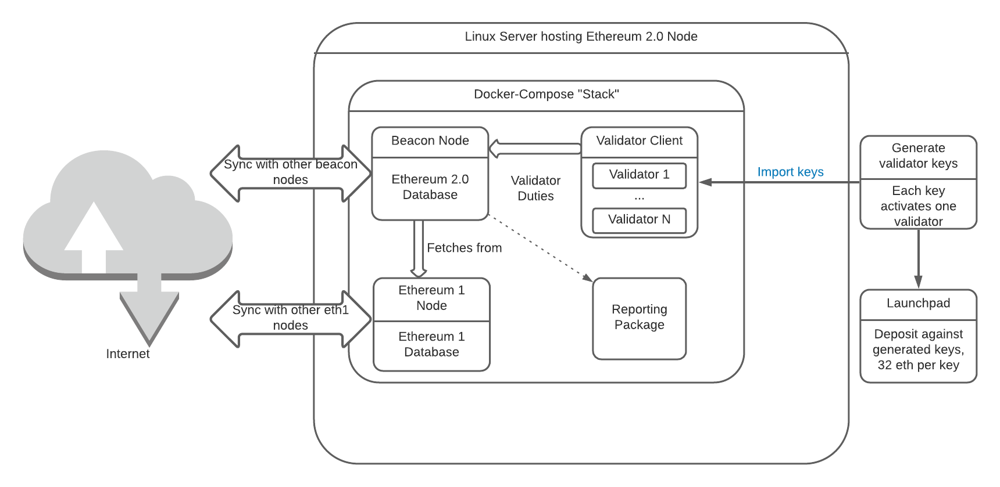

# eth2-docker v0.1.8.8

Unofficial docker environment for Ethereum 2.0 clients

## Acknowledgements

Parts of this guide are based on the Linux [guides](https://medium.com/@SomerEsat) written by [Somer Esat](https://twitter.com/SomerEsat).

Without their previous work, this project would not exist.

## High Level Overview

An Ethereum 2.0 node has many moving parts. Here's a high level, conceptual overview.



When setting up an Ethereum 2.0 node, you'll:

- Configure and run an Ethereum 1 node and sync it with the Görli testnet or main net
- Alternatively, choose an external provider of Ethereum 1 chain data
- Configure and run an Ethereum 2.0 beacon node and sync it with an Ethereum 2.0 testnet or main net
- Generate validator keys, one per 32 Eth you wish to stake. This can and often is done outside of the
  machine used to run the node, for security reasons.
- Import validator keys into the validator client, each validator key activates one validator
- Once the Ethereum 1 and Ethereum 2.0 nodes are fully synced with the chain, deposit Ethereum
  at the launchpad, 32 eth per validator key. That Ethereum is now locked up until the "merge" phase
  of Ethereum 2.0, sometimes also referred to as "phase 1.5".

Here's what then happens:

- The chain processes the deposit and activates the validators: Your validators start earning rewards
  and penalties.
- The beacon node is where it all happens: Block generation, attestations, slashings, with the help
  of the validator(s) inside the validator client, for signing.
- A validator earns a reward for every epoch (6.4 minutes) it is online, and a penalty of 3/4 that
  amount for every epoch it is offline. "Online" means that it sent its scheduled attestation / block
  proposal. This means you want to be online almost 24/7, but do not have to be afraid of a few hours
  of downtime, with the exception of periods of non-finality.
- Greater 2/3 of validators need to be online for the chain to "finalize". If the chain stops finalizing,
  far harsher penalties for offline validators kick in. Stay online during non-finality. The initial
  penalties on main net for this "inactivity" during non-finality have been reduced to 1/4th of their eventual
  values.
- "Slashing" is a harsh penalty and forced exit for malicious validators; regular penalties could be
  described as "Leaking" instead. The most likely mistake that gets you slashed is to run a validator key
  in two separate validator clients simultaneously. The initial slashing penalty on main net has been reduced
  to 1/4th of its eventual value.
- If all of the above was so much Gobbledegook, you need to read the [Ethereum 2.0 primer](https://ethos.dev/beacon-chain/) and come
  back to it every time you have questions. 

## Supported clients

This project can build from official docker images or from official source repositories. In most cases,
binary is the default.

Currently supported clients:
- Lighthouse
- Prysm
- Teku
- Nimbus

Currently supported optional components:
- geth, local eth1 node.
- nethermind, local eth1 node - testing only, DB corruption observed on goerli and mainnet
- openethereum, local eth1 node - testing only, DB corruption observed on mainnet
> Use one of the local eth1 node options or a 3rd-party provider of eth1 chain data to "feed"
> your eth2 beacon node, so you can [propose](https://ethos.dev/beacon-chain/) blocks.
- slasher, Running slasher is optional, but helps secure the chain and may result in additional earnings.
- Grafana dashboard

Please see [WEB](WEB.md) for experimental Web UI support on Prysm, and use the Web instead
of validator-import to import keys.

# USAGE

## Before you start

Warnings about the dangers of running eth2 nodes are in [RECOMMENDATIONS.md](RECOMMENDATIONS.md).
That file also contains a link to SomerEsat's [guide on host security](https://medium.com/@SomerEsat/guide-to-staking-on-ethereum-2-0-ubuntu-medalla-nimbus-5f4b2b0f2d7c), and comments on key security.
Please take a look.

## Steps to bring an eth2 node up

1. Install prerequisites
2. Choose a client and do initial setup.
3. Build the client
4. Generate deposit files and an eth2 wallet. This can be done within this project, or outside of it
5. Import the validator keystore files generated in the previous step
6. Run the client
7. Finalize the deposit. This is not done within this project
8. A baseline set of Grafana dashboards are included, see step 8.  Feel free to add more, or submit a PR with your favorite dashboards.
9. Configure your system to start the eth2 node on boot (optional)

## Step 1: Install prerequisites

You will need git, docker, and docker-compose. This should work on Linux, possibly MacOS.
Running a node via this project on Windows 10 is [highly discouraged](WINDOWS.md) because of time
synchronization concerns.
Please see [prerequisites](PREREQUISITES.md) and then come back here.

## Step 2: Choose a client, initial setup

Next, choose a client and configure this project to use it.
Please see [setup instructions](SETUP.md) and then come back here.

## Step 3: Build the client

> **Important** Before you build, verify once more that `LOCAL_UID` in `.env`
> is the UID of your user (check with `echo $UID`), and that the file `.env`
> (dot env) is called exactly that, and contains the parameters you expect.
> You will get errors about missing permissions, during Step 4, if the UID is wrong.

Build all required images. If building from source, this may take 20-30 minutes. Assuming
you cloned the project into `eth2-docker`:
```
cd ~/eth2-docker && sudo docker-compose build
```

## Step 4: Create an eth2 wallet and validator keystore and deposit files

You will deposit eth to the deposit contract, and receive locked eth2 in turn.<br />
> **Vital** [RECOMMENDATIONS.md](RECOMMENDATIONS.md) has comments on key security. If you haven't
read these yet, please do so now. You need to know how to guard your keystore password
and your seed phrase (mnemonic). **Without the mnemonic, you will be unable to withdraw your funds
after the "merge", also called phase 1.5 of Ethereum 2.0. You need the seed phrase or your eth is gone forever.**

> You can create the keys using eth2-docker. For mainnet, you may want to create
> the keys on a machine that is not connected to the Internet, and will be wiped
> afterwards. This can be done by downloading [eth2.0-deposit-cli](https://github.com/ethereum/eth2.0-deposit-cli)
> directly and copying it to that machine, or by fetching the eth2-docker project
> on that machine, then disconnecting it from Internet. After you've created
> keys, you'd move them off the machine, wipe the machine used to create them,
> copy them to the machine the node will run on, and continue from
> "You brought your own keys", below.

Make sure you're in the project directory, `cd ~/eth2-docker` by default.

This command will create the keys to deposit Eth against:<br />
`sudo docker-compose run --rm deposit-cli`

Choose the number of validators you wish to create.
> A validator is synonymous to one 32 Ethereum stake. Multiple validators
> can be imported to a single validator client.

The created files will be in the directory `.eth2/validator_keys` in this project.
> eth2.0-deposit-cli shows you a different directory, that's because it has a view
> from inside the container.
 
This is also where you'd place your own keystore files if you already have some for import.

### You brought your own keys

They go into `.eth2/validator_keys` in this project directory, not directly under `$HOME`.

## Step 5: Create a validator client wallet by importing validator keys

**Warning** Import your validator key(s) to only *one* client.

> If you want to use the experimental [Prysm Web UI](WEB.md), use it to
> import keys and not this command-line process.

Import the validator key(s) to the validator client:

`sudo docker-compose run --rm validator-import`

> #### Prysm-specific
> - You will be asked whether you will be using the Web UI to import keys.
> Answer "y"es only if you are testing Prysm's experimental Web UI via
> `prysm-web.yml`
> - You will be asked to provide a "New wallet password", independent of the
>   keystore password. 
> - If you choose not to store the wallet password with the validator,
>   you will need to edit `prysm-base.yml` and comment out the wallet-password-file
>   parameter

If you choose to save the password during import, it'll be available to the client every
time it starts. If you do not, you'll need to be present to start the
validator client and start it interactively. Determine your own risk profile.

## Step 6: Start the client

To start the client:
```
sudo docker-compose up -d eth2
```
> **Nimbus and Teku**: Beacon and validator client run in the same process, there is only one container for both

If, however, you chose not to store the wallet password with the validator client, you will need
to bring the beacon and, if in use, eth1, up individually instead, then "run"
the validator client so it can prompt you for input:

```
sudo docker-compose up -d eth1 beacon
sudo docker-compose run validator
```

After providing the wallet password, use the key sequence Ctrl-p Ctrl-q to detach
from the running container.

## Step 7: Depositing

**Caution**: You may wish to wait until the beacon node is fully synchronized before you deposit. Check
its logs with `sudo docker-compose logs -f beacon`. This safe-guards against the validator being
marked offline if your validator is activated before the beacon syncs.

Once you are ready, you can send eth to the deposit contract by using
the `.eth2/validator_keys/deposit_data-TIMESTAMP.json` file at the [Pyrmont launchpad](https://pyrmont.launchpad.ethereum.org/)
or [Mainnet launchpad](https://launchpad.ethereum.org). This file was created in Step 4.

> You can transfer files from your node to a machine with a browser using scp. A graphical
> tool such as WinSCP will work, or you can use [command line scp](https://linuxize.com/post/how-to-use-scp-command-to-securely-transfer-files/).

## Step 8: Grafana Dashboards

A baseline set of dashboards has been included.  
- [Metanull's Prysm Dashboard JSON](https://raw.githubusercontent.com/metanull-operator/eth2-grafana/master/eth2-grafana-dashboard-single-source.json)
- [Prysm Dashboard JSON](https://raw.githubusercontent.com/GuillaumeMiralles/prysm-grafana-dashboard/master/less_10_validators.json)
- [Prysm Dashboard JSON for more than 10 validators](https://raw.githubusercontent.com/GuillaumeMiralles/prysm-grafana-dashboard/master/more_10_validators.json)
- [Lighthouse Dashboard JSON](https://raw.githubusercontent.com/sigp/lighthouse-metrics/master/dashboards/Summary.json)
- [Nimbus Dashboard JSON](https://raw.githubusercontent.com/status-im/nimbus-eth2/master/grafana/beacon_nodes_Grafana_dashboard.json)
- [Teku Dashboard](https://grafana.com/api/dashboards/12199/revisions/1/download)

Connect to http://YOURSERVERIP:3000/, log in as admin/admin, and set a new password.
> Grafana runs over http without encryption, which is not secure. Do not expose the Grafana port to the Internet. You can
> use [SSH tunneling](https://www.howtogeek.com/168145/how-to-use-ssh-tunneling/) to reach Grafana securely over the Internet.

In order to load other Dashboards, follow these instructions.

- Click on the + icon on the left, choose "Import".
- Copy/paste JSON code from the Raw github page of the Dashboard you chose - click anywhere inside the page, use Ctrl-A to select all and Ctrl-C to copy
- Click "Load"
- If prompted for a data source choose the "prometheus" data source
- Click "Import".

## Step 9: Autostart the client on boot

If you are using the "unless-stopped" restart policy, docker will start the 
client for you. That said, you may wish to make sure this happens on
startup even if the client was stopped. In that case, create a service
to start the client on boot.

For Linux systems that use systemd, e.g. Ubuntu, you'd create a systemd
service. 

- Copy the file: `sudo cp sample-systemd /etc/systemd/system/eth2.service`
- Edit the file: `sudo nano /etc/systemd/system/eth2.service`
- Adjust the `WorkingDirectory` to the directory you stored the project in.
- Adjust the path to `docker-compose` to be right for your system, see `which docker-compose`
- Test the service: From within the project directory, `sudo docker-compose down` to shut
  it down, then `sudo systemctl daemon-reload`, `sudo systemctl start eth2` to bring it back up,
  and check `sudo docker ps` to see all expected containers are up.
- Enable the service: `sudo systemctl enable eth2`

## Addendum: Monitor the client

Monitoring the logs of the client is useful for troubleshooting
and to judge the amount of time left before the beacon and eth1 nodes
are fully synchronized.

To see a list of running containers:

```
sudo docker ps
```

To see the logs of a container:

```
sudo docker logs -f CONTAINERNAME
```

or

```
sudo docker-compose logs -f SERVICENAME
```

## Addendum: Update the software

This project does not monitor client versions. It is up to you to decide that you
are going to update a component. When you are ready to do so, the below instructions
show you how to.

Please see the [changelog](CHANGELOG.md) to see what changed between versions.

### The eth2-docker tool itself

Inside the project directory, run:<br />
`git pull`

Then `cp .env .env.bak` and `cp default.env .env`, and set variables inside `.env`
the way you need them, with `.env.bak` as a guide.

### The client "stack"

If you are using binary build files - the default - you can update everything
in the client "stack" with `sudo docker-compose build --pull`. If you
run shared components in a different directory, such as eth1, traefik, or portainer,
you'd `cd` into those directories and run the command there.

### Eth1

Run:<br />
`sudo docker-compose build --no-cache --pull eth1`

Then stop, remove and start eth1:<br />
`sudo docker-compose stop eth1 && sudo docker-compose rm eth1`<br />
`sudo docker-compose up -d eth1`

### Client

Beacon and validator client share the same image for most clients, we only need to rebuild one.

Run:<br />
`sudo docker-compose build --no-cache --pull beacon`

For Prysm, also run:<br />
`sudo docker-compose build --no-cache --pull validator`

And if using the Prysm slasher, run:<br />
`sudo docker-compose build --no-cache --pull slasher`

Then restart the client:<br />
`sudo docker-compose down && sudo docker-compose up -d eth2`

If you did not store the wallet password with the validator client, come up 
[more manually](#start-the-client) instead.

## Addendum: Remove all traces of the client

This project uses docker volumes to store the Ethereum 1 and Ethereum 2.0 databases, as
well as validator keys for the validator client. You can see these volumes with
`sudo docker volume ls` and remove them with `sudo docker volume rm`, as long as they are
not in use.

This can be useful when moving between testnets or from a testnet to main net, without
changing the directory name the project is stored in; or when you want to start over
with a fresh database. Keep in mind that synchronizing Ethereum 1 can take days on main
net, however.

## Addendum: Add or recover validators

You can use eth2.0-deposit-cli to either recover validator signing keys or add
additional ones, if you wish to deposit more validators against the same mnemonic.
> The same cautions apply as when creating keys in the first place. You
> may wish to take these steps on a machine that is disconnected from Internet
> and will be wiped immediately after creating the keys.

In order to recover all your validator signing keys, run `sudo docker-compose run --rm deposit-cli-add-recover`
and provide your mnemonic, then set index to "0" and the number of validators to the number you had created previously
and are now recreating.

In order to add additional validator signing keys, likewise run `sudo docker-compose run --rm deposit-cli-add-recover`
and provide your mnemonic, but this time set the index to the number of validator keys you had created previously,
for example, `4`. New validators will be created after this point. You will receive new `keystore-m` signing keys
and a new `deposit_data` JSON.

> Please triple-check your work here. You want to be sure the new validator keys are created after
> the existing ones. Launchpad will likely safeguard you against depositing twice, but don't rely
> on it. Verify that the public keys in `deposit_data` are new and you did not deposit for them
> previously.
 
## Addendum: Voluntary client exit

Ethereum 2.0 has a concept of "voluntary client exit", which will remove the
validator from attesting duties. Locked Eth could be withdrawn after the "merge"
aka "phase 1.5", and not sooner.

Currently, Prysm and Lighthouse support voluntary exit. This requires a fully synced
beacon node.

### Prysm

To exit, run `sudo docker-compose run validator-voluntary-exit` and follow the
prompts.

If you wish to exit validators that were running on other clients, you can do this
as follows:

- Stop the other client(s), and wait 20 minutes. This is so you won't have
  a validator attest in the same epoch twice.
- Copy all `keystore-m` JSON files into `.eth2/validator_keys` in this project
  directory.
- Stop the Prysm client in this project, `sudo docker-compose down`
- Import the new keys via `sudo docker-compose run validator-import`. Note
  that Prysm assumes they all have the same password. If that's not the case,
  maybe work in batches.
- Verify once more that the old client is down, has been for 20 minutes, and
  can't come back up. **If both the old client and this Prysm run at the same time,
  you will slash yourself**
- Bring the Prysm client up: `sudo docker-compose up -d eth2`
- Check logs until the beacon is synced: `sudo docker-compose logs -f beacon`
- Initiate voluntary exit and follow the prompts: `sudo docker-compose run validator-voluntary-exit`


### Lighthouse

The exit procedure for lighthouse is not very refined, yet.

- Copy the `keystore-m` JSON files into `.eth2/validator_keys` in this project
  directory.
- Run `sudo docker-compose run --rm validator-voluntary-exit /var/lib/lighthouse/validator_keys/<name-of-keystore-file>`,
  once for each keystore (validator) you wish to exit.
- Follow prompts.

> The directory `.eth2/validator_keys` is passed through to docker as `/var/lib/lighthouse/validator_keys`. Lighthouse
> expects you to explicitly name the `keystore-m` file for which you wish to process an exit. Because this can
> be confusing, here's an example:
```
yorick@ethlinux:~/eth2-pyrmont$ ls .eth2/validator_keys/
deposit_data-1605672506.json  keystore-m_12381_3600_0_0_0-1605672506.json
yorick@ethlinux:~/eth2-pyrmont$ sudo docker-compose run --rm validator-voluntary-exit /var/lib/lighthouse/validator_keys/keystore-m_12381_3600_0_0_0-1605672506.json
Starting eth2-pyrmont_beacon_1 ... done
Running account manager for pyrmont testnet
validator-dir path: "/var/lib/lighthouse/validators"

Enter the keystore password for validator in "/var/lib/lighthouse/validator_keys/keystore-m_12381_3600_0_0_0-1605672506.json":
```

### Avoid penalties

Note you will need to continue running your validator until the exit
has been processed by the chain, if you wish to avoid incurring offline
penalties. You can check the status of your validator with tools such
as [beaconcha.in](https://beaconcha.in) and [beaconscan](https://beaconscan.com).

## Addendum: Troubleshooting

A few useful commands if you run into issues. As always, `sudo` is a Linux-ism and may not be needed on MacOS.

`sudo docker-compose stop servicename` brings a service down, for example `docker-compose stop validator`.<br />
`sudo docker-compose down` will stop the entire stack.<br />
`sudo docker-compose up -d servicename` starts a single service, for example `sudo docker-compose up -d validator`.
The `-d` means "detached", not connected to your input session.<br />
`sudo docker-compose run servicename` starts a single service and connects your input session to it. Use the Ctrl-p Ctrl-q
key sequence to detach from it again.

`sudo docker ps` lists all running services, with the container name to the right.<br />
`sudo docker logs containername` shows logs for a container, `sudo docker logs -f containername` scrolls them.<br />
`sudo docker-compose logs servicename` shows logs for a service, `sudo docker-compose logs -f servicename` scrolls them.<br />
`sudo docker exec -it containername /bin/bash` will connect you to a running service in a bash shell. The eth1 service doesn't have a shell
if using geth.<br />

You may start a service with `sudo docker-compose up -d servicename` and then find it's not in `sudo docker ps`. That means it terminated while
trying to start. To investigate, you could leave the `-d` off so you see logs on command line:<br />
`sudo docker-compose up beacon`, for example.<br />
You could also run `sudo docker-compose logs beacon` to see the last logs of that service and the reason it terminated.<br />

If a service is not starting and you want to bring up its container manually, so you can investigate, first bring everything down:<br />
`sudo docker-compose down`, tear down everything first.<br />
`sudo docker ps`, make sure everything is down.<br />

If you need to see the files that are being stored by services such as beacon, validator, eth1 node, grafana, &c, in Ubuntu Linux you can find
those in /var/lib/docker/volumes. `sudo bash` to invoke a shell that has access.

**HERE BE DRAGONS** You can totally run N copies of an image manually and then successfully start a validator in each and get yourself slashed.
Take extreme care.

Once your stack is down, to run an image and get into a shell, without executing the client automatically:<br />
`sudo docker run -it --entrypoint=/bin/bash imagename`, for example `sudo docker run -it --entrypoint=/bin/bash lighthouse`.<br />
You'd then run Linux commands manually in there, you could start components of the client manually. There is one image per client.<br />
`sudo docker images` will show you all images.

# Guiding principles:

- Reduce the attack surface of the client as much as feasible.
  None of the eth2 clients lend themselves to be statically compiled and running
  in "scratch" containers, alas.
- Guide users to good key management as much as possible
- Create something that makes for a good user experience and guides people new to docker and Linux as much as feasible

LICENSE: MIT
